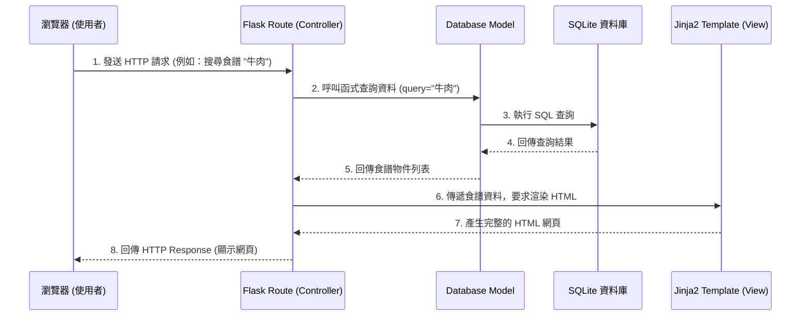

# 系統架構設計 (System Architecture)

基於「食譜收藏夾」PRD 需求，本文件定義了專案的系統架構與資料夾結構。

## 1. 技術架構說明

### 選用技術與原因
- **後端框架：Python + Flask**
  - **原因**：Flask 是輕量級且靈活的框架，非常適合快速開發 MVP（最簡可行產品），並且學習曲線平緩，適合初學者。
- **前端模板引擎：Jinja2**
  - **原因**：與 Flask 完美整合，能在伺服器端直接將動態資料（如食譜列表、材料等）渲染至 HTML 頁面，不需額外建置複雜的前端打包環境。
- **資料庫：SQLite (透過 sqlite3 或 SQLAlchemy)**
  - **原因**：SQLite 屬於輕量級檔案型資料庫，不需要安裝額外的資料庫伺服器（如 MySQL 或 PostgreSQL），適合目前的食譜儲存規模，且備份與轉移非常方便。

### Flask MVC 模式說明
雖然我們沒有使用前後端分離，但我們仍遵循類似 MVC (Model-View-Controller) 的設計模式來讓程式碼保持整潔：
- **Model (模型)**：負責與資料庫互動的邏輯。定義食譜的資料表結構（如 `Recipe`, `Ingredient`, `Step`），並處理新增、查詢等動作。
- **View (視圖)**：Jinja2 模板（`.html` 檔案）。負責將資料轉化為使用者看得到的網頁畫面。
- **Controller (控制器)**：Flask 路由 (`routes`)。負責接收使用者的 HTTP 請求（例如點擊「搜尋」），呼叫對應的 Model 取得資料，最後將資料交給 View 進行渲染回傳給使用者。

## 2. 專案資料夾結構

為了讓程式碼好維護，我們將專案結構如下規劃：

```text
web_app_development/
├── app/                      # 應用程式主要資料夾
│   ├── __init__.py           # 初始化 Flask 應用程式
│   ├── models/               # (Model) 資料庫模型與操作邏輯
│   │   ├── __init__.py
│   │   └── recipe_model.py   # 定義食譜、食材、步驟等資料表結構
│   ├── routes/               # (Controller) 路由與商業邏輯
│   │   ├── __init__.py
│   │   ├── recipe_routes.py  # 食譜相關路由（新增、列表、詳細頁、搜尋）
│   │   └── main_routes.py    # 網站首頁等通用路由
│   ├── templates/            # (View) Jinja2 HTML 模板
│   │   ├── base.html         # 共用版型（導覽列、頁尾）
│   │   ├── index.html        # 首頁 / 食譜列表頁
│   │   ├── recipe_detail.html# 食譜詳細頁面
│   │   └── recipe_form.html  # 新增 / 編輯食譜頁面
│   └── static/               # 靜態資源檔案
│       ├── css/
│       │   └── style.css     # 自訂樣式表
│       ├── js/               # 前端互動腳本
│       └── images/           # 食譜圖片預設存放位置
├── instance/                 # 存放環境特定檔案（不進入 Git 版控）
│   └── database.db           # SQLite 實體資料庫檔案
├── docs/                     # 專案說明文件
│   ├── PRD.md                # 產品需求文件
│   └── ARCHITECTURE.md       # 系統架構文件（本文件）
├── requirements.txt          # Python 套件依賴清單
└── app.py                    # 專案程式啟動入口
```

## 3. 元件關係圖

以下展示當使用者瀏覽網站時，各元件如何互相協作的流程圖：



## 4. 關鍵設計決策

1. **伺服器端渲染 (SSR)**：
   我們選擇透過 Flask + Jinja2 在後端直接渲染 HTML，而非建置 React/Vue 等前端框架。這樣可以大幅降低 MVP 開發複雜度，並能確保基礎的 SEO (搜尋引擎最佳化)。
2. **路由拆分模組化 (Blueprints)**：
   我們將路由依照功能拆分到 `routes/` 目錄中（例如 `recipe_routes.py`），而不是全部塞在同一個 `app.py` 裡。這有助於未來加入會員系統或收藏夾功能時，能更容易維護程式碼結構的清晰度。
3. **圖片儲存策略 (MVP)**：
   在 MVP 階段，為了簡化開發，我們暫定將使用者上傳的圖片直接儲存在本機的 `static/images/` 資料夾內，並在資料庫中只儲存圖片的「相對路徑字串」。
4. **單一資料庫檔案 (SQLite)**：
   選擇 SQLite 不需額外的資料庫連線設定，且將資料庫檔案放在獨立的 `instance/` 目錄，可避免不小心將使用者的本機測試資料 commit 進 Git 版本庫中。
