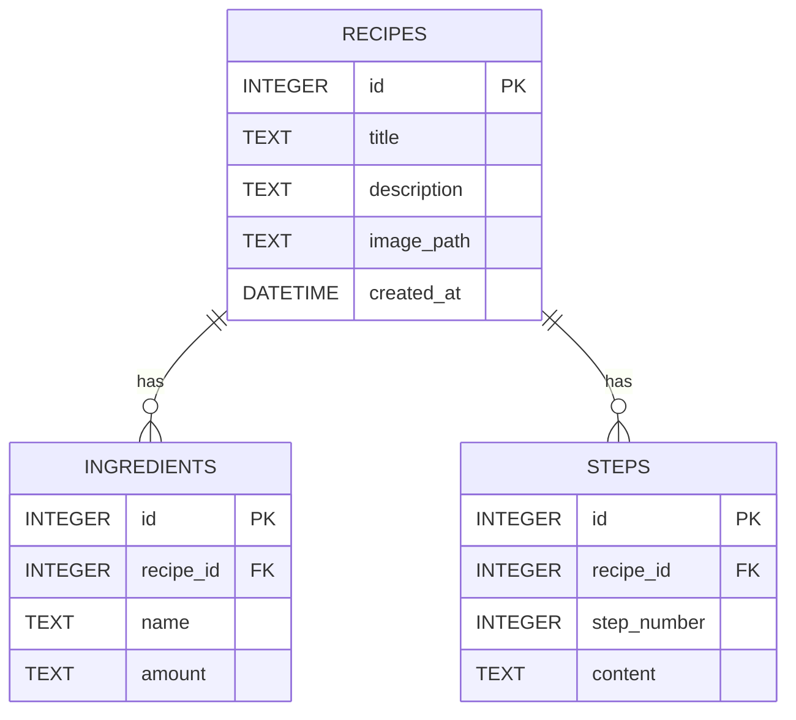

# 資料庫設計 (Database Design)

本文件基於食譜收藏夾的功能需求，定義 SQLite 資料庫的結構與關聯。

## 1. ER 圖（實體關係圖）

## 2. 資料表詳細說明

### `recipes` (食譜表)
儲存食譜的基本資訊。
- `id`: INTEGER, Primary Key, 自動遞增。
- `title`: TEXT, 食譜名稱 (必填)。
- `description`: TEXT, 簡介。
- `image_path`: TEXT, 圖片相對路徑。
- `created_at`: DATETIME, 建立時間，預設為當下時間。

### `ingredients` (食材表)
儲存每道食譜所需的食材與份量。
- `id`: INTEGER, Primary Key, 自動遞增。
- `recipe_id`: INTEGER, Foreign Key，關聯至 `recipes.id`。
- `name`: TEXT, 食材名稱 (必填)。
- `amount`: TEXT, 份量 (例如：300g, 2匙)。

### `steps` (步驟表)
儲存料理步驟。
- `id`: INTEGER, Primary Key, 自動遞增。
- `recipe_id`: INTEGER, Foreign Key，關聯至 `recipes.id`。
- `step_number`: INTEGER, 步驟順序 (例如 1, 2, 3)。
- `content`: TEXT, 步驟說明內容 (必填)。
