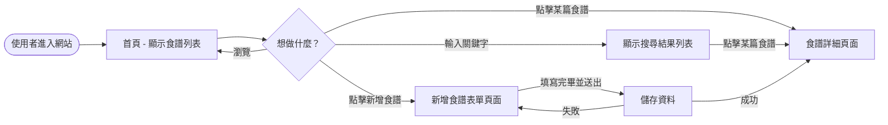
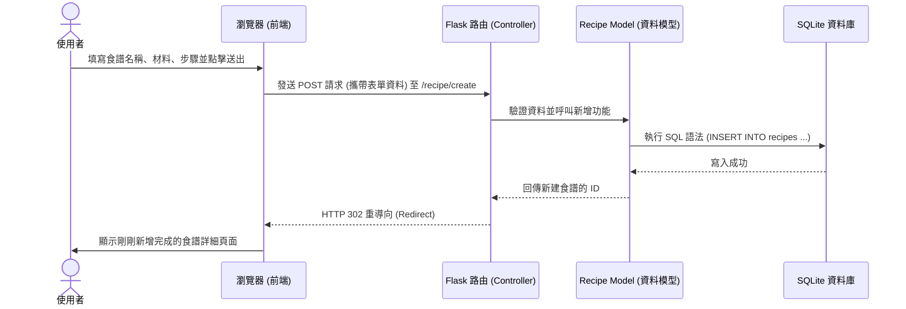

# 系統流程圖與使用者操作路徑

本文件根據產品需求文件 (PRD) 與系統架構文件 (Architecture)，將使用者的操作路徑以及系統背後的資料流動視覺化，確保所有功能邏輯清晰無遺漏。

## 1. 使用者流程圖 (User Flow)

這張圖展示了使用者進入「食譜收藏夾」網站後，可以進行的各種操作路徑。

## 2. 系統序列圖 (Sequence Diagram)

這裡以「**新增食譜**」這項核心功能為例，展示從使用者在網頁上按下「送出」那一刻起，背後的 Flask 伺服器與 SQLite 資料庫是如何互相溝通並儲存資料的。

## 3. 功能清單對照表

我們將第一階段 MVP 的功能對應到未來要開發的網址（URL 路徑）與 HTTP 方法，這將幫助我們後續順利實作 Flask 路由。

| 功能名稱 | URL 路徑 | HTTP 方法 | 說明 |
| :--- | :--- | :--- | :--- |
| **瀏覽食譜列表 (首頁)** | `/` | `GET` | 顯示所有食譜或最新食譜。 |
| **搜尋食譜** | `/search` | `GET` | 透過網址參數 (如 `?q=牛肉`) 搜尋食譜。 |
| **檢視單一食譜** | `/recipe/<id>` | `GET` | 顯示特定 ID 食譜的詳細材料與步驟。 |
| **新增食譜 (填寫表單)** | `/recipe/create` | `GET` | 顯示新增食譜的空白表單網頁。 |
| **新增食譜 (送出儲存)** | `/recipe/create` | `POST` | 接收表單送過來的資料並存入資料庫。 |

*(註：編輯、刪除與收藏功能，將於後續階段規劃路由時補上。)*
